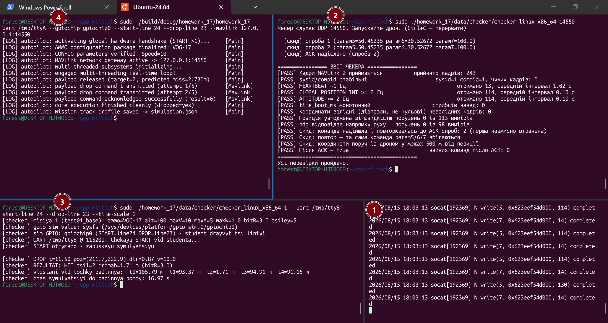
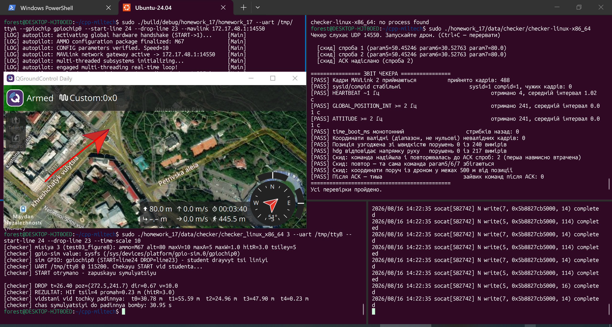

# Ballistic Autopilot Flight Computer

Багатопотокова бортова програма автопілота для БПЛА з інтегрованим балістичним солвером, мережевим шлюзом MAVLink/UDP та модулем експорту польотних логів у форматі JSON.

## 🚀 Порядок локального тестування (Запуск у 4 терміналах)

Для повноцінної симуляції місії необхідно відкрити **4 окремих вікна термінала** та запустити команди строго у вказаній послідовності.

---

### 📦 Термінал 1: Віртуальний UART-міст
Створення віртуальних зв'язаних портів `/tmp/ttyA` та `/tmp/ttyB` для забезпечення обміну даними між автопілотом і симулятором фізики.
```bash
sudo socat -d -d pty,raw,echo=0,link=/tmp/ttyA,mode=666 pty,raw,echo=0,link=/tmp/ttyB,mode=666
```

---

### 🌐 Термінал 2: Мережевий валідатор MAVLink
Запуск мережевого шлюзу, який слухає UDP-порт `14550`, приймає телеметрію дрона, відправляє наказ на підтвердження скиду (`COMMAND_ACK`) та перевіряє протокол зв'язку.
```bash
sudo ./homework_17/data/checker/checker-linux-x86_64 14550
```

---

### 🎯 Термінал 3: Симулятор фізики польоту та цілей
Запуск симулятора навколишнього середовища. Симулятор підключається до порту `/tmp/ttyB`, керує віртуальними GPIO-лініями та прораховує балістику влучання боєприпасу.
```bash
sudo ./homework_17/data/checker/checker_linux_x86_64 4 --uart /tmp/ttyB --start-line 24 --drop-line 23 --time-scale 10
```

---

### 💻 Термінал 4: Бортовий автопілот
Запуск основного виконавчого бінарника автопілота. Він зчитує телеметрію через `/tmp/ttyA`, виконує балістичний розрахунок точки зустрічі, керує скидом через GPIO та дублює координати в мережу MAVLink.
```bash
sudo ./build/debug/homework_17/homework_17 --uart /tmp/ttyA --gpiochip gpiochip0 --start-line 24 --drop-line 23 --mavlink 127.0.0.1:14550
```

---

## 📊 Результати роботи
Після успішного отримання мережевого підтвердження `COMMAND_ACK` та фіксації влучання, автопілот автоматично завершує всі потоки і створює файл звіту місії: **`data/simulation.json`**

## 📷 Результати виконання місії

### Консольні логи роботи утиліт та чекера фізики


### Візуалізація польоту БПЛА в QGroundControl (через WSL-мережевий міст)

