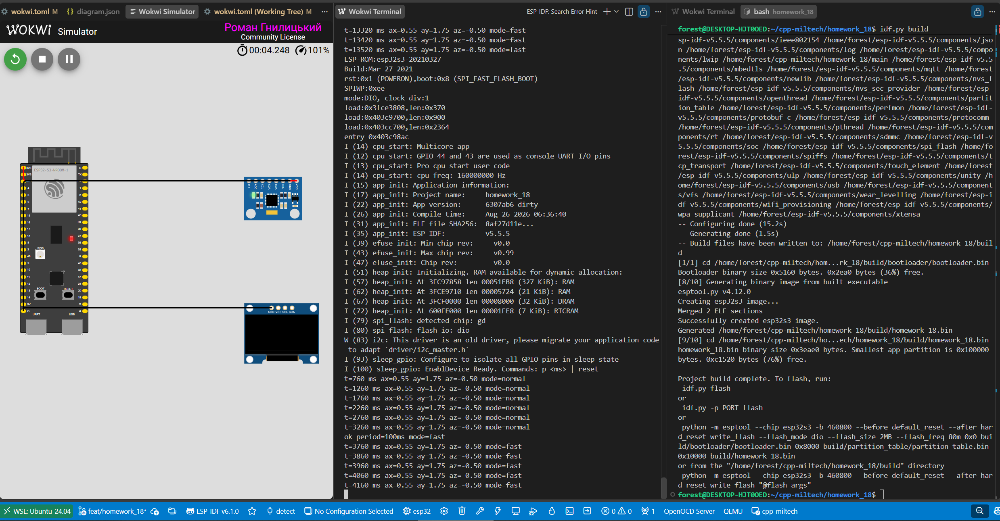

# 🛠️ ESP32-S3: UART & I2C Telemetry Peripheral

Embedded-система на базі фреймворку ESP-IDF для асинхронного збору телеметрії з датчика MPU-6050 (I2C) та обробки команд керування через консоль (UART).

---

## 📸 Результат роботи (Скріншот)



---

## 🚀 Швидкий запуск

Виконайте в терміналі для збірки:

```bash
# 1. Перехід у робочу директорію завдання
cd path/to/homework_18

# 2. Активація ESP-IDF
. $HOME/esp-idf-v5.5/export.sh

# 3. Повне очищення та компіляція
idf.py fullclean
idf.py set-target esp32s3 build
```

### Запуск у VS Code (Wokwi):
1. Відкрийте файл `diagram.json`.
2. Натисніть **`F1`** (або `Ctrl + Shift + P`).
3. Виберіть **`Wokwi: Start Simulator`** та натисніть Enter.

---

## 🕹️ Керування (Команди в терміналі)

Клікніть мишкою у чорне вікно терміналу Wokwi та вводьте команди (наосліп):

* `p <мс>` — змінити період опитування (від `50` до `5000` мс).
  * `p 100` — швидкий режим (`fast`).
  * `p 1000` — повільний режим (`slow`).
* `reset` — скинути налаштування до стандартних (`500` мс, режим `normal`).

💡 **Порада:** Під час симуляції клікніть мишкою по датчику MPU-6050 — ви зможете рухати повзунки осей, щоб побачити зміну значень телеметрії в реальному часі!
